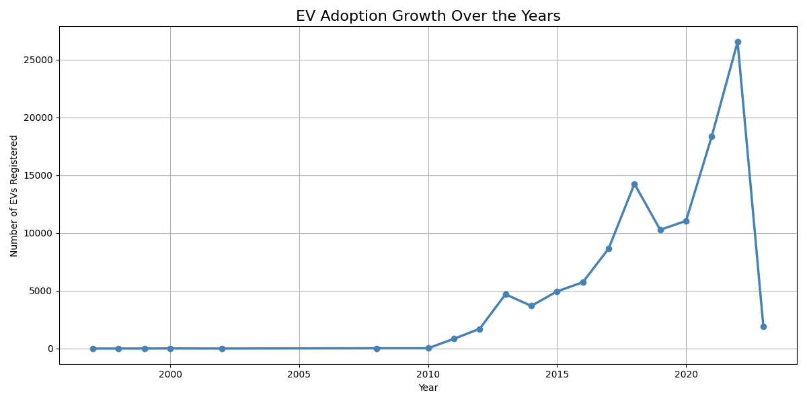
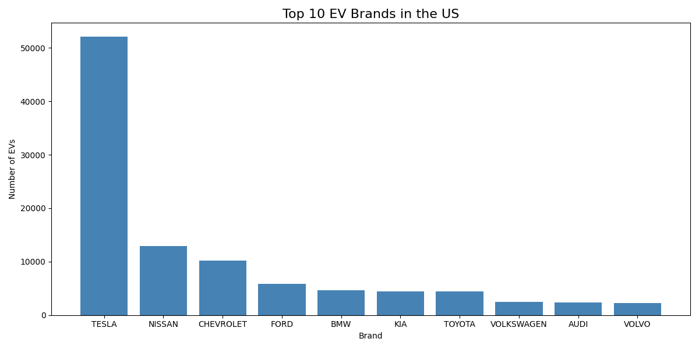
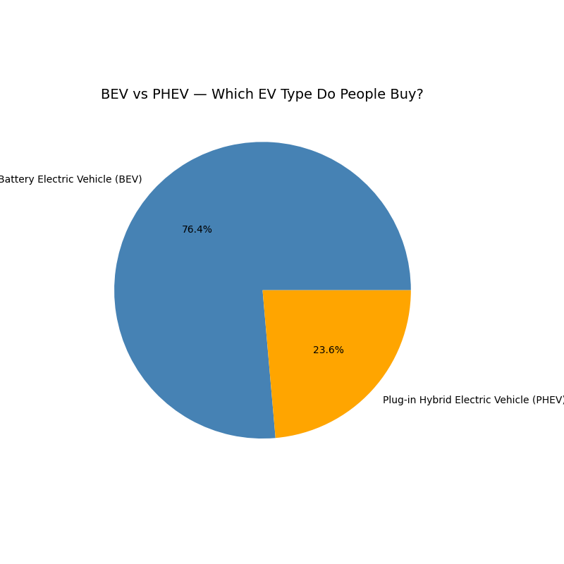
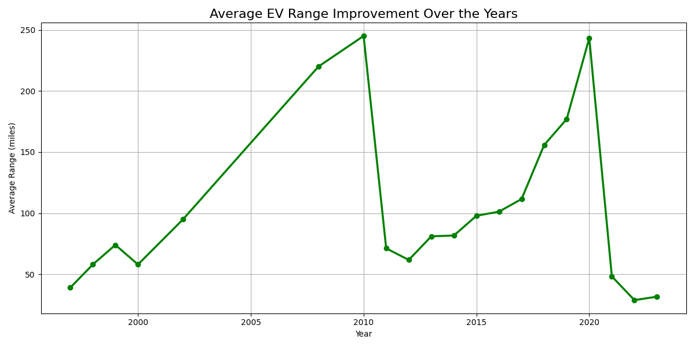

EV Market Analysis 
Analysed 112,634 real US electric vehicle registrations 
using Python and Pandas.

What I Found
- Tesla dominates with 46% market share
- EV registrations grew from 1 car in 1997 to 26,530 in 2022
- 76% of buyers choose fully electric (BEV) over hybrid
- Electric range is improving but not in a straight line

Tools Used
- Python
- Pandas
- Matplotlib

Charts

